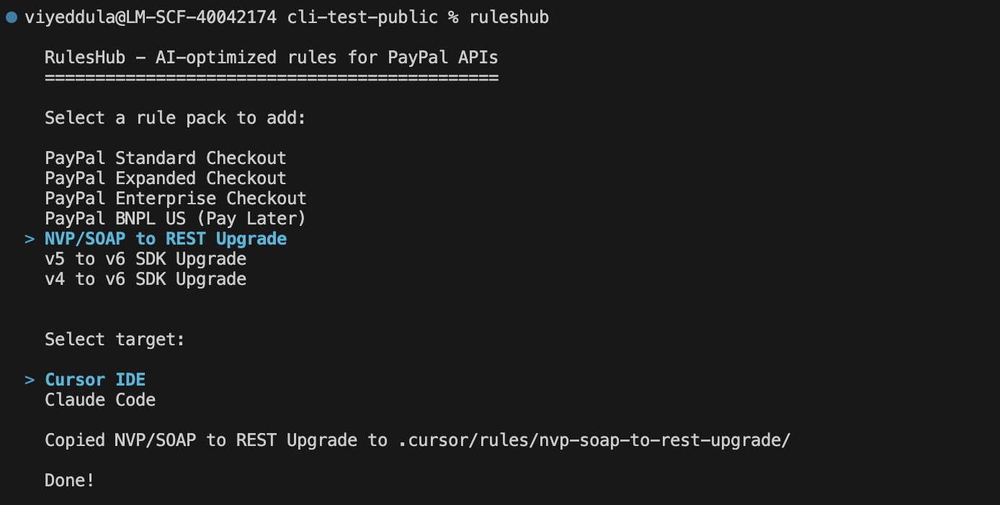
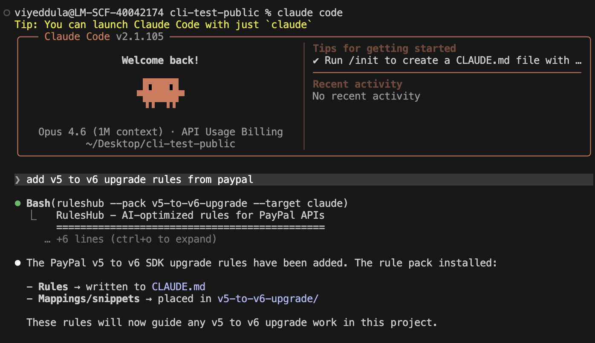

# RulesHub (Beta)

A comprehensive collection of AI-optimized rules and guidelines for integrating, upgrading popular APIs and platforms. These rules are designed to work seamlessly with AI code assistants like Cursor IDE and Claude Code to provide intelligent, context-aware code suggestions for new integrations, upgrades, and migrations.

## Table of Contents

- [Available Rule Packs](#available-rule-packs)
  - [PayPal Standard Checkout](#paypal-standard-checkout)
  - [PayPal Expanded Checkout](#paypal-expanded-checkout)
  - [PayPal Enterprise Checkout](#paypal-enterprise-checkout)
  - [PayPal BNPL US (Pay Later)](#paypal-bnpl-us-pay-later)
  - [PayPal NVP/SOAP to REST API Upgrade](#paypal-nvpsoap-to-rest-api-upgrade)
  - [PayPal v5 to v6 Web SDK Upgrade](#paypal-v5-to-v6-web-sdk-upgrade)
  - [PayPal v4 to v6 Web SDK Upgrade](#paypal-v4-to-v6-web-sdk-upgrade)
- [How to Use](#how-to-use)
  - [Method 1: RulesHub CLI](#method-1-ruleshub-cli)
  - [Method 2: Direct Copy](#method-2-direct-copy)
  - [Method 3: Git Submodule](#method-3-git-submodule)
  - [Method 4: Reference in Existing Files](#method-4-reference-in-existing-files)
- [Key Benefits](#key-benefits)
  - [Intelligent Code Detection](#intelligent-code-detection)
  - [Comprehensive Coverage](#comprehensive-coverage)
  - [AI-Optimized Design](#ai-optimized-design)
- [Scenarios](#scenarios)
  - [Scenario 1: Starting a New Integration](#scenario-1-starting-a-new-integration)
  - [Scenario 2: Legacy Code Upgrade](#scenario-2-legacy-code-upgrade)
  - [Scenario 3: Code Review and Security Audit](#scenario-3-code-review-and-security-audit)
- [Customization](#customization)
  - [Adding Your Own Rules](#adding-your-own-rules)
  - [Environment-Specific Adaptations](#environment-specific-adaptations)
- [Security First](#security-first)
- [Feedback](#feedback)
- [Contributing](#contributing)
  - [Contribution Guidelines](#contribution-guidelines)
- [Resources](#resources)
- [License](#license)

## Available Rule Packs

### PayPal Standard Checkout

**Location**: `paypal-checkout/standard-checkout/`

Build a new PayPal checkout integration with Smart Payment Buttons, or enhance an existing one.

**Features:**

- PayPal branded checkout button integration
- Server-side order creation and capture
- Multi-language support (Node.js, Python, PHP, Java, .NET, Ruby)
- Security best practices and PCI compliance
- Sandbox testing and debugging patterns

### PayPal Expanded Checkout

**Location**: `paypal-checkout/expanded-checkout/`

Build or enhance an expanded checkout integration with advanced card fields and additional payment methods.

**Features:**

- Advanced card field integration (hosted fields)
- 3D Secure authentication support
- Custom card form styling and validation
- Multi-payment method support
- PCI-compliant card processing patterns

### PayPal Enterprise Checkout

**Location**: `paypal-checkout/enterprise-checkout/`

Build or enhance an enterprise-level checkout integration for platforms and marketplaces.

**Features:**

- Braintree Direct and Multiparty integration
- Platform and marketplace payment flows
- Vault and recurring payment patterns
- Advanced fraud protection and risk management
- PCI Level 1 compliance guidance

### PayPal BNPL US (Pay Later)

**Location**: `paypal-bnpl-us/`

Add Buy Now Pay Later capabilities to new or existing PayPal integrations for US merchants.

**Features:**

- Pay Later messaging and button integration
- Pay in 4 and Pay Monthly options
- Upstream messaging placement guidance
- Eligibility and merchant configuration

### PayPal NVP/SOAP to REST API Upgrade

**Location**: `upgrade-nvp-soap-to-rest/`

Upgrade from PayPal legacy APIs (NVP/SOAP) to modern REST APIs, or start a new REST API integration from scratch.

**Features:**

- Automatic legacy code pattern detection
- REST API endpoint mappings with official documentation links
- Multi-language support (Node.js, Python, PHP, Java, .NET, Ruby)
- Security best practices and vulnerability detection
- Side-by-side code transformation examples
- Webhook implementation patterns
- Environment configuration templates

### PayPal v5 to v6 Web SDK Upgrade

**Location**: `upgrade-to-v6/v5-to-v6-upgrade/`

Upgrade from PayPal v5 Web SDK to v6, or start a new v6 Web SDK integration with the latest patterns and features.

**Features:**

- **Interactive Upgrade Detection**: Analysis of existing v5 implementations
- **Pattern-Based Conversion**: Detection and transformation of v5 patterns to v6
- **Save Payment/Vault Operations**: Implementation of payment method storage and reuse
- **Payment Methods**: Support for Venmo, Pay Later, and Credit messaging
- **Security Implementation**: Server-side token generation and credential management
- **TypeScript Support**: TypeScript definitions and type-safe implementations
- **Error Handling**: Debug IDs and operational patterns
- **Upgrade Strategies**: Parallel testing and phased rollout approaches

### PayPal v4 to v6 Web SDK Upgrade

**Location**: `upgrade-to-v6/v4-to-v6-upgrade/`

Upgrade from PayPal checkout.js v4 to v6 Web SDK, or start a new v6 Web SDK integration.

**Features:**

- **Terminology Mapping**: Complete v4 to v6 button label and funding source mapping
- **Pattern-Based Conversion**: Detection and transformation of v4 patterns to v6
- **Component Migration**: Checkout.js to web components migration
- **Payment Methods**: Venmo, Pay Later, and additional funding sources
- **Server Integration**: Updated server-side order and capture flows
- **Error Handling**: Debug IDs and v6 error patterns

## How to Use

### Method 1: RulesHub CLI

Interactive CLI that copies the rule pack you need into your project -- whether you're starting a new integration or upgrading an existing one.

**Setup (one-time):**

```bash
# Clone the repo
git clone https://github.com/paypal/ruleshub.git

# Link it globally
cd ruleshub
npm link

# Then from any project folder:
cd your-project
ruleshub

or 

npm install git+https://github.com/paypal/ruleshub.git
```

The CLI will prompt you to:
1. Select a rule pack
2. Select a target (Cursor IDE or Claude Code)

Files are copied to the appropriate location automatically.



You can also use flags for non-interactive mode:

```bash
ruleshub --pack 4 --target 1
```


### Method 2: Direct Copy
Copy the relevant rules file to your project:

```bash
# Choose the appropriate rule pack for your project
cp [rule-pack-folder]/rules.md your-project/.cursor/rules/CURSOR.mdc  # For Cursor IDE
cp [rule-pack-folder]/rules.md your-project/CLAUDE.md     # For Claude Code
```

### Method 3: Git Submodule
Add RulesHub as a submodule to your project:

```bash
cd your-project
git submodule add https://github.com/paypal/ruleshub.git rules
```

### Method 4: Reference in Existing Files
Add references in your existing `CURSOR.mdc` or `CLAUDE.md`:

```markdown
# PayPal Rules
Apply patterns from RulesHub/[rule-pack-folder]/rules.md
```

## Key Benefits

### Intelligent Code Detection

- **Pattern Recognition**: AI assistants detect legacy code patterns (NVP/SOAP calls, v5 SDK implementations) and guide new integrations
- **Context-Aware Suggestions**: Integration and upgrade suggestions based on code context
- **Security Scanning**: Detection of security vulnerabilities and practices
- **Setup Analysis**: Detection of current PayPal integration patterns through code analysis

### Comprehensive Coverage

- **Multi-Language Support**: Rules work across JavaScript, TypeScript, Python, PHP, Java, .NET, and more
- **Integration & Upgrade Paths**: From new integrations to upgrades, authentication to webhooks, various aspects covered
- **Payment Methods**: Support for save payments, Venmo, Pay Later, and credit messaging
- **Best Practices**: Industry-standard security and performance practices included

### AI-Optimized Design

- **Cursor IDE Integration**: Integration with Cursor's AI capabilities
- **Claude Code Compatible**: Works with Claude Code's context understanding
- **Documentation**: Includes links to official API documentation and examples
- **Integration & Upgrade Support**: Enables new integrations, parallel testing, and phased rollouts
- **TypeScript Definitions**: Type safety and IntelliSense support

## Scenarios

### Scenario 1: Starting a New Integration

When beginning a new PayPal integration (checkout, BNPL, payments), AI assistants will:

- Guide you through the latest API patterns (REST APIs, v6 SDK)
- Provide configuration templates and code examples
- Include error handling and security best practices
- Recommend current practices for checkout, Pay Later, and vaulting
- Support multi-language implementations (Node.js, Python, PHP, Java, .NET, Ruby)

### Scenario 2: Legacy Code Upgrade

When working with existing legacy code:

- Detect outdated patterns (NVP/SOAP, v5 SDK)
- Suggest equivalents (REST APIs, v6 SDK)
- Provide step-by-step upgrade guidance
- Support backward compatibility during transition
- Support parallel testing strategies

### Scenario 3: Code Review and Security Audit

During development and review:

- Flag potential security issues
- Suggest performance optimizations
- Recommend latest API versions and patterns (v6 SDK, REST APIs)
- Support compliance with platform guidelines
- Validate error handling and debug patterns

## Customization

### Adding Your Own Rules
Each rule pack folder can be extended with project-specific rules:

```markdown
## Custom Project Rules
- Your specific business logic patterns
- Internal coding standards
- Company-specific security requirements
- Custom payment flow implementations
- Environment-specific SDK configurations
```

### Environment-Specific Adaptations
Modify rules for different deployment environments:

```markdown
## Development Environment
- Enable verbose logging
- Use sandbox/test endpoints
- Include debugging information
- Enable PayPal Debug IDs for troubleshooting
- Use development SDK configurations

## Production Environment
- Minimize sensitive data logging
- Use production endpoints
- Enhanced security validation
- Implement proper error handling
```

## Security First

All rule packs prioritize security:

- **Credential Management**: Environment variable recommendations
- **HTTPS Enforcement**: Secure communication patterns only
- **Data Protection**: No logging of sensitive information
- **Vulnerability Detection**: Automatic flagging of security issues
- **Compliance**: Platform-specific compliance requirements
- **Server-Side Token Generation**: Client token patterns
- **Webhook Signature Verification**: Webhook security implementation

## Feedback

We'd love to hear about your experience with RulesHub.

- **PayPal Documentation** - Official guides and API references: https://developer.paypal.com/

## Contributing

Help improve RulesHub by:

1. **Testing Rules**: Use the rules in your projects and provide feedback
2. **Documenting Gaps**: Report missing patterns or edge cases
3. **Adding New Upgrades**: Contribute rules for other platforms
4. **Improving Examples**: Enhance code examples and documentation

### Contribution Guidelines
- Test all rules thoroughly before submitting
- Include comprehensive documentation
- Follow existing file structure and naming conventions
- Ensure security best practices are maintained

## Resources

- **API Documentation**: Links to official platform documentation
  - [PayPal REST APIs](https://developer.paypal.com/api/rest/)
  - [PayPal v6 Web SDK](https://docs.paypal.ai/payments/methods/paypal/sdk/js/v6/paypal-checkout)
  - [PayPal Vault/Save Payments](https://docs.paypal.ai/payments/save/sdk/paypal/js-sdk-v6-vault)
- **Upgrade Guides**: Platform-specific upgrade resources
- **Community Support**: Developer community forums and support
- **Best Practices**: Industry-standard implementation patterns
- **TypeScript Definitions**: Official type definitions for v6 SDK

## License

See [LICENSE](LICENSE) for details.

---

> **Note**: Start with sandbox/test environments when using these rule packs. Validate all implementations against your specific business requirements before deploying to production.
> 
> **New to PayPal?** Use the checkout and BNPL rule packs to build your integration from scratch with best practices built in. **Upgrading?** Use the migration and upgrade rule packs to move from legacy APIs or older SDKs to the latest versions.
