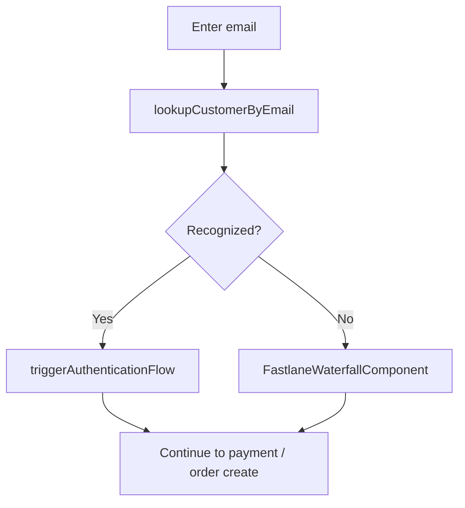

# Fastlane — Accelerated Guest Checkout (Expanded Checkout)

Fastlane speeds up **guest checkout** by recognizing returning customers and streamlining authentication. Load the **`fastlane`** component in **JS SDK v6**, then use the Fastlane identity and UI APIs.

## SDK initialization

Include **`fastlane`** in `components`:

```javascript
const sdk = await window.paypal.createInstance({
  clientId: process.env.PUBLIC_PAYPAL_CLIENT_ID,
  clientToken,
  components: ['paypal-payments', 'card-fields', 'fastlane'],
  pageType: 'checkout',
});
```

Script URLs (same as core v6):

| Environment | URL |
|-------------|-----|
| Sandbox | `https://www.sandbox.paypal.com/web-sdk/v6/core` |
| Production | `https://www.paypal.com/web-sdk/v6/core` |

## Create Fastlane instance

```javascript
async function createFastlane(sdk) {
  const fastlane = await sdk.createFastlane?.();
  if (!fastlane) {
    throw new Error('Fastlane not available — check eligibility and components');
  }
  return fastlane;
}
```

Exact factory names follow the current v6 reference (`createFastlane` vs namespace) — verify against [Fastlane docs](https://docs.paypal.ai/payments/methods/cards/fastlane).

## `identity.lookupCustomerByEmail(email)`

```javascript
async function lookupCustomer(fastlane, email) {
  const identity = fastlane.identity;
  if (!identity?.lookupCustomerByEmail) {
    throw new Error('Fastlane identity API not available');
  }
  const result = await identity.lookupCustomerByEmail(email);
  return result;
}
```

Use the result to branch **recognized** vs **unrecognized** customers.

## `identity.triggerAuthenticationFlow(customerContextId)`

For recognized customers, trigger the authentication flow when you have a **customer context** from lookup:

```javascript
async function authenticateRecognizedCustomer(fastlane, customerContextId) {
  return fastlane.identity.triggerAuthenticationFlow(customerContextId);
}
```

Handle success and errors in UI (OTP / passkey flows vary by implementation and region).

## FastlaneWaterfallComponent — new / unrecognized customers

For **new** or unrecognized users, render the waterfall component to collect shipping/payment with Fastlane UX:

```javascript
async function renderWaterfall(fastlane, container, options) {
  const Waterfall = fastlane.FastlaneWaterfallComponent || fastlane.components?.FastlaneWaterfall;
  if (!Waterfall) {
    console.warn('Waterfall component not exposed on this SDK build');
    return;
  }
  const instance = new Waterfall({
    container,
    onComplete: options.onComplete,
    onError: options.onError,
  });
  await instance.render();
  return instance;
}
```

API names are illustrative — match the SDK reference for your exact version.

## Recognized vs unrecognized flows



## Common issues

| Issue | Resolution |
|-------|------------|
| Fastlane missing | Add `fastlane` to `components`; confirm merchant eligibility. |
| Lookup always empty | Email not in network; fall back to waterfall or standard guest. |
| Auth flow fails | Check sandbox buyer setup; inspect console and PayPal debug IDs. |

## Best practices

- Do not block checkout if Fastlane fails — fall back to standard card/PayPal.
- Keep **email** collection GDPR-/CAN-SPAM-compliant.
- Align **order create/capture** with the same session as Fastlane completion.
